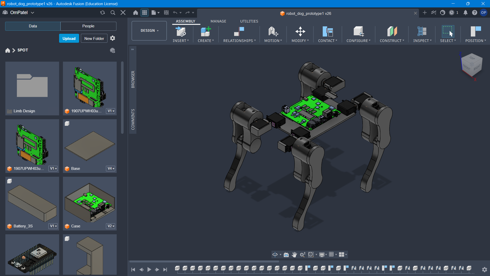
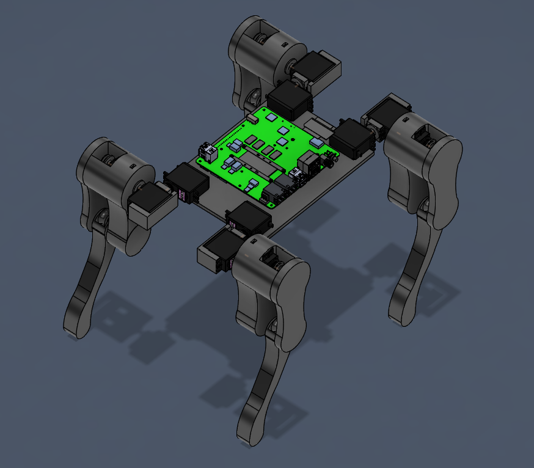

# SPOT Computer Vision Suite

SPOT Computer Vision Suite is a desktop vision hub built for SPOT, a quadruped robot dog. While desktop face recognition might look simple on the surface, real-time facial identification and head pose tracking are essential for a robot dog to safely identify humans and interact naturally in physical environments.

## Robot Dog CAD Photos





## Features

* Mandatory calibration gate that locks the live video feed until at least one identity is enrolled.
* Interactive 3-step calibration wizard (Center, Left, Right) using real-time yaw estimation and visual AR overlays.
* Deep feature extraction using OpenCV YuNet face detection and SFace 128-dimensional neural network embeddings.
* Dynamic dependency checking and automatic model file provisioning.

## Run the shipped application

Download and extract `SPOT_Suite_Windows_v1.0.zip` from the releases page, then run `SPOT_Suite.exe`. It runs on Windows without requiring a Python installation. Required model weights download automatically on first launch if they are missing.

## Build from source

Requirements:

* Python 3.9+
* Connected webcam
* Windows 10/11

```bash
git clone https://github.com/your-username/spot-vision-suite.git
cd spot-vision-suite
python main.py
```

To package into a folder distribution using PyInstaller:

```bash
pip install pyinstaller
pyinstaller --noconfirm --onedir --windowed --name "SPOT_Suite" main.py
```

The output folder will be generated at `dist/SPOT_Suite/`.

## Development History and Iterations

This project went through 6 major iterations to reach this release. Because I was working on this entirely offline without an internet connection at the time, intermediate commits could not be pushed to GitHub as development progressed.

Earlier versions gave the operator manual control over individual computer vision parameters, tracking subroutines, and detection thresholds. While that gave granular control, it introduced too much friction when operating a physical robot dog.

This current version reduces those manual knobs to keep the system streamlined, while retaining an interactive AR calibration process so the operator still feels connected to the robot's setup. The core recognition backend was also upgraded from basic geometric landmark matching to 128-dimensional deep feature embeddings (YuNet and SFace) for dependable human recognition.

## Project layout

* `main.py` for application source code and GUI engine
* `data/models/` for ONNX neural network models and saved identity profiles
